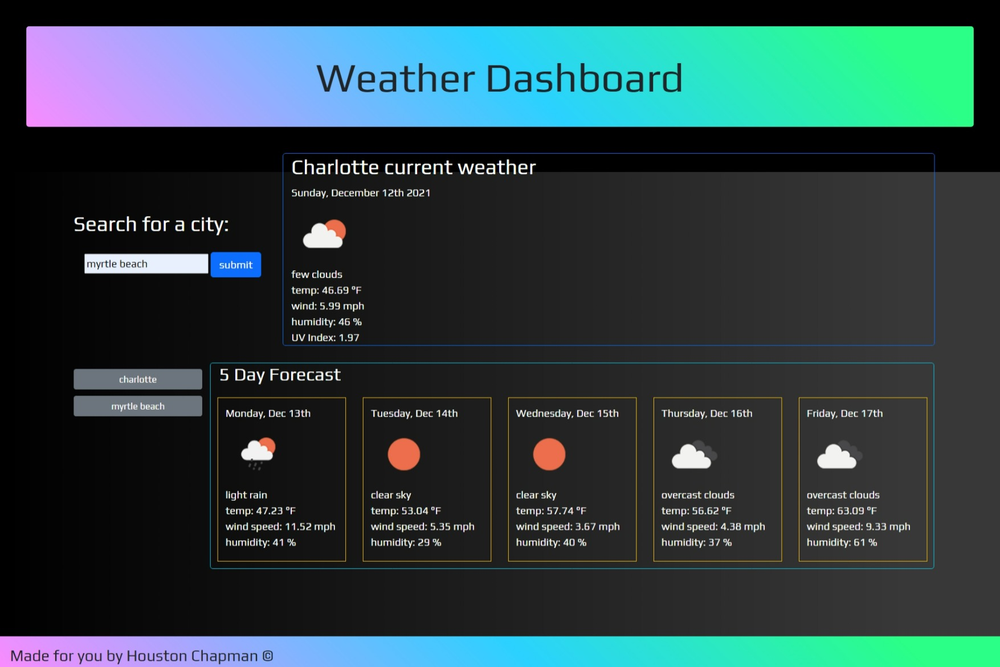

# Weather-Dashboard

## Checkout the weather for over 200,000 cities!

This repository contains the code for a weather application created with JavaScript, HTML, and CSS

By using the Open Weather API https://openweathermap.org/api the user can:

* Retrieve city specific current weather
     - weather conditions for current date with an icon
     - temperature in degrees farenheight
     - wind speed in miles per hour
     - humidity percentage
     - current UV index

* Retrieve 5 day forecast for city searched
     - future day of the week with date
     - icon for predicted weather conditions
     - temp
     - wind speed
     - humidity

* Easily display past city searches by clicking buttons that are dynamically created and use local storage
- page will only display past 6 city searches

### [Access the site by this link!](https://chapmanh10.github.io/weather-dashboard/)

